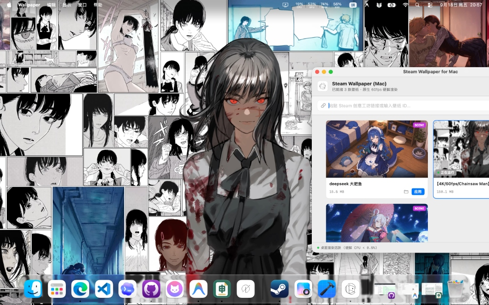
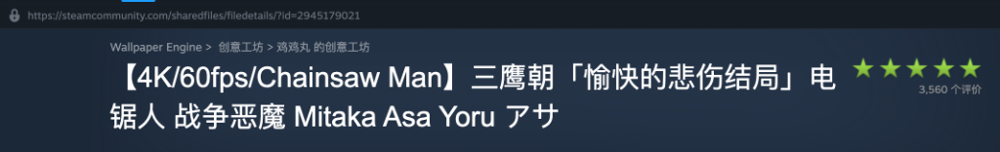

# Steam Wallpaper for Mac 🖥️✨

一个专为 macOS 打造的高性能、轻量级 Steam Wallpaper Engine 原生伴侣应用。纯 Swift 6 (SwiftUI + AppKit + SpriteKit + Metal + WebKit) 原生开发，旨在带来极低能耗、硬件加速、丝滑流畅的动态壁纸桌面体验。



---

## ⚠️ 使用前必读（前提条件）

为了能够通过 Steam 官方高速通道正常下载和使用创意工坊壁纸，请确保满足以下条件：

1. **Mac 本地已安装并运行 Steam 客户端**：
   - 应用程序需要通过本地运行的 Steam 调度官方下载通道。
2. **Steam 账户中已购买 Wallpaper Engine**：
   - 因为 Steam 创意工坊下载 API 仅对已拥有该软件的账户开放下载权限。
3. **在创意工坊中复制链接即可**：
   - 在 Steam 创意工坊页面右键复制壁纸链接（或复制网址栏链接、纯数字工坊 ID）。

---

## 🎨 当前支持与兼容性说明

本应用采用原生多媒体与图形管线开发，目前对不同类型的壁纸支持程度如下：

| 壁纸类型 | 支持状态 | 说明 |
| :--- | :---: | :--- |
| **Video 视频壁纸** | **完美支持** | 采用 macOS 原生 `AVFoundation` + 硬件解码器，4K 60fps 极其流畅，CPU 占用率低于 0.5%，完全不发热。 |
| **Web 网页壁纸** | **完美支持** | 基于 macOS 原生 `WebKit` (`WKWebView`)，完整支持 HTML5、Canvas、WebGL 与 CSS3 动画，支持系统休眠与全屏暂停。 |
| **静态壁纸 (Static)** | **完美支持** | 提取超清原图，智能 Aspect Fill 居中裁切自适应屏幕比例，绝不拉伸变形。 |
| **Scene 场景壁纸** | **部分支持** | 支持基础 2D 图层合成、SpriteKit 粒子特效（星空、流星、烟雨等）与原声音乐播放。由于部分复杂场景使用了 Windows 专用的 Puppet 2D 骨骼网格与 DirectX/HLSL 着色器，部分复杂人物场景可能存在对齐错位或着色差异，建议优先选用 Video 视频壁纸、Web 网页壁纸或经典粒子场景。 |

---

## 📥 下载安装（推荐）

通过 GitHub Actions 自动构建，每当发布新版本时会自动编译并打包发布至 Releases：

1. 前往 GitHub 仓库的 **Releases** 页面；
2. 下载最新的 `SteamWallpaper-macOS.zip` 压缩包；
3. 双击解压后将 `Wallpaper.app` 拖入 `/Applications`（访达应用程序）文件夹；
4. 双击打开即可使用！
   *(注：若首次打开提示“无法打开，因为无法验证开发者”，请前往系统设置 -> 隐私与安全性 -> 点击“仍要打开”即可。)*

---

## 🌟 核心特性

- **🚀 一键工坊直连下载**：
  - 复制创意工坊链接或 ID 粘贴即可，系统自动调度本地 Steam 官方高速 CDN 下载，无需第三方代理或登录 Cookie。
- **⚡ 极致轻量与硬件加速**：
  - 拒绝臃肿的 Electron 与第三方 Chromium 内核；
  - 基于 macOS 原生渲染管线，日常运行内存仅 50~80MB，笔记本待机电池续航不受影响。
- **📐 智能比例自适应**：
  - 严格保持画面原始高宽比（Aspect Fill），支持超宽屏、带鱼屏与各类 MacBook Retina 视网膜屏幕，画面居中裁剪，绝不拉伸挤压。
- **🔋 智能能耗守护（PowerManager）**：
  - 自动感知全屏应用（如全屏写代码、全屏看视频、玩游戏），全屏时自动挂起壁纸渲染，释放 100% GPU/CPU 算力；退出全屏平滑恢复。
- **🎛️ 菜单栏常驻控制中心**：
  - 顶部状态栏托盘提供一键静音、暂停/继续、快速切壁纸和快速呼出相册功能。

---

## 📖 使用方法

1. **打开 Steam 客户端**：
   - 确保 Mac 上的 Steam 已登录并且正在后台运行。
2. **在创意工坊复制壁纸链接**：
   - 在 Steam 社区创意工坊的 Wallpaper Engine 分区中找到喜欢的壁纸；
   - 右键选择“复制网页链接”（例如：`https://steamcommunity.com/sharedfiles/filedetails/?id=2945179021`）或直接复制纯数字 ID。

   
3. **一键下载并应用**：
   - 打开 **Steam Wallpaper for Mac**；
   - 在主界面顶部的下载栏粘贴链接，点击 **“下载并提取”**；
   - 下载完成后会自动解析并立即应用为当前桌面壁纸！
4. **壁纸库管理**：
   - 之前下载过的壁纸会自动保留在本地画廊中；
   - 点击壁纸卡片上的 **“应用”** 按钮即可一键无缝切换桌面；
   - 点击文件夹图标可直接在访达（Finder）中定位源文件。

---

## 🛠️ 构建与开发

### 环境要求
- macOS 13.0 (Ventura) 及以上版本
- Xcode 15+ 或 Swift 6.0+ 工具链

### 本地构建与打包

```bash
# 1. 运行快速启动脚本
./run.sh

# 2. 或者使用 Swift Package Manager 编译 Release 版本
swift build -c release

# 3. 打包生成 Wallpaper.app 应用程序包（加 --zip 可同时生成安装 zip）
./bundle.sh --zip
```

### 自动化 Release 发布（GitHub Actions）
- 项目配置了自动化 CI/CD 流水线 ([.github/workflows/release.yml](.github/workflows/release.yml))。
- **自动触发**：推送版本标签（例如 `git tag v1.0.0 && git push origin v1.0.0`）；
- **手动触发**：在 GitHub 仓库页面的 Actions -> "Release Steam Wallpaper for Mac" -> 点击 "Run workflow"；
- 工作流会在 macOS 虚拟环境中自动完成代码检出、单元测试、打包签名，并自动将生成的 `SteamWallpaper-macOS.zip` 挂载至 Releases 供用户下载安装。

---

## 🧱 技术架构

```text
Sources/
├── WallpaperCore/                 # 底层跨模块核心库
│   ├── Models.swift               # 壁纸元数据、类型定义与下载状态模型
│   ├── SteamWorkshopService.swift # Steam 创意工坊链接解析与元数据请求
│   ├── SteamDownloader.swift      # Steam 客户端指令桥接与下载监控
│   ├── WallpaperParser.swift      # project.json 与 scene.pkg 二进制解包引擎
│   ├── SceneRenderer.swift        # SpriteKit + Metal 场景与粒子特效渲染器
│   ├── DesktopEngine.swift        # NSWindow 桌面置底层级、AVPlayer、SpriteKit 与 WebKit 控制
│   ├── PowerManager.swift         # 全屏应用监听与自适应低能耗调度
│   └── WallpaperStore.swift       # 响应式状态管理与本地壁纸库同步
└── WallpaperApp/                  # SwiftUI 原生前端应用
    ├── AppEntry.swift             # App 主入口与生命周期托管
    ├── StatusBarController.swift     # 状态栏菜单常驻控制器
    └── Views/
        ├── GalleryView.swift      # 壁纸画廊相册主界面
        ├── WallpaperCardView.swift    # 响应式壁纸卡片组件
        └── DownloadBarView.swift      # 创意工坊链接下载栏
```

---

## 📄 开源许可

本项目遵循 MIT 许可证开源。所有在 Steam 创意工坊下载的壁纸版权归其原作者所有。
