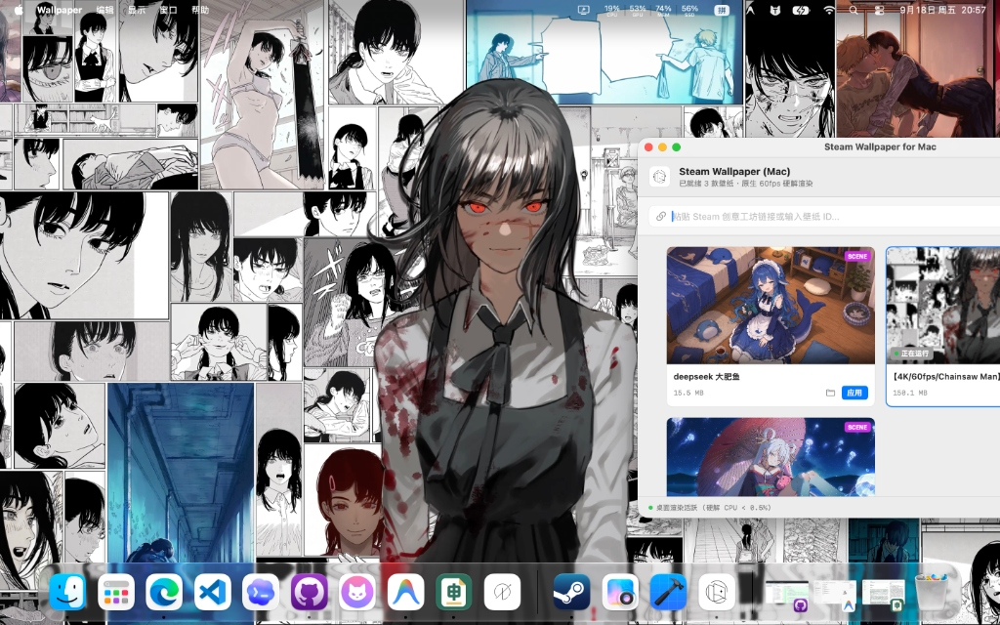
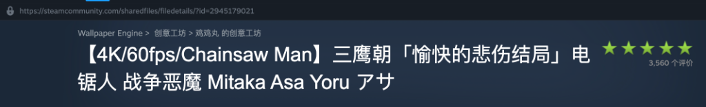

<div align="center">
  
  <h1>Steam Wallpaper for macOS</h1>
  <p><strong>专为 Apple Silicon 与 Intel Mac 打造的高性能原生 Wallpaper Engine 伴侣应用。</strong></p>
  <p>纯 Swift 原生开发 · Metal + WebKit + AVFoundation 硬件加速 · 告别臃肿 Electron</p>

[](https://github.com/yubinbin32-ops/wallpaper-for-macos/releases/latest)
[](https://github.com/yubinbin32-ops/wallpaper-for-macos/stargazers)
[](https://apple.com/macos)
[](https://swift.org)
[](https://developer.apple.com/metal/)
[](LICENSE)

<p>原生 Metal 渲染管线 · 1:1 WebKit 桥接 · 硬件解码 4K 60fps · 仅 ~50MB 内存占用</p>

[English](README.md) · [简体中文](README_zh.md) · [下载与安装](#下载与安装推荐) · [兼容性说明](#壁纸类型支持与兼容性) · [核心特性](#核心特性) · [技术架构](#技术架构)
</div>

---

## 为 Mac 桌面带来真正丝滑的原生动态壁纸体验



**Steam Wallpaper for macOS** 是一款专为 Mac 深度调优的高性能、轻量级 Steam Wallpaper Engine 原生伴侣应用。纯 Swift (SwiftUI + AppKit + Metal + WebKit + AVFoundation) 原生开发，旨在带来极低能耗、满血硬件加速、60fps+ 丝滑流畅的动态壁纸桌面体验。

彻底告别臃肿缓慢的 Electron 封装与发热掉电的第三方 Chromium 移植。应用直连 macOS 底层桌面窗口层级（`.desktopWindow`），充分调用 Apple Silicon 芯片硬件解码与 GPU 算力，日常运行时风扇不转、电池不尿崩。

---

## 壁纸类型支持与兼容性

得益于全新的渲染管线升级，本应用目前**完整且完美支持创意工坊四大主流壁纸格式**：

| 壁纸类型 | 支持状态 | 渲染引擎与管线 | 技术亮点与说明 |
| :--- | :---: | :--- | :--- |
| **Scene 场景壁纸 (`.pkg`)** | **完美支持** | 原生 Metal 管线 (`MetalScenePipeline`) + SpriteKit | 内置纯 Swift LZ4 解块引擎与 PKG 解构器、TEX 贴图解码、多层 2D 精灵图层合成、动态粒子特效模拟（星空、流星、烟雾、微光等）与原声音乐同步播放。 |
| **Web 网页壁纸 (`HTML5` / `WebGL`)** | **完美支持** | 原生 WebKit (`WKWebView`) + `WebWallpaperBridge` | 1:1 实现 Wallpaper Engine 官方 JavaScript 属性桥接（`window.wallpaperPropertyListener`），完整支持 Canvas、WebGL 3D、CSS3 动画、本地沙箱资源访问与智能休眠/静音。 |
| **Video 视频壁纸 (`MP4` / `WebM`)** | **完美支持** | 原生 `AVFoundation` + 硬件 VideoToolbox | 4K 60fps 丝滑播放，`AVPlayerLooper` 无缝循环零卡顿，硬件硬解 CPU 占用低于 0.5%，机器完全不发热。 |
| **Image 静态壁纸 (`Static`)** | **完美支持** | 原生 `AppKit` / `CoreGraphics` | 提取超清原图，智能 Aspect Fill 居中裁切自适应各类屏幕，在 MacBook Retina 视网膜屏及带鱼屏上绝不拉伸变形。 |

---

## 使用前必读（前提条件）

为了能够通过 Steam 官方高速通道正常下载和使用创意工坊壁纸，请确保满足以下条件：

1. **Steam 账户中已购买 Wallpaper Engine**：
   - 因为 Steam 创意工坊下载 API 仅对已拥有该软件的账户开放下载权限。
2. **下载壁纸时需要打开 Steam 客户端**：
   - 应用通过与正在运行的 Steam 客户端进行本地 IPC 通信来调度官方 CDN 下载，因此**在下载壁纸时，必须保持 Steam 客户端处于打开并登录状态**（在后台挂着即可）。
3. **在创意工坊中复制链接即可**：
   - 在 Steam 创意工坊页面右键复制壁纸链接（或复制网址栏链接、纯数字工坊 ID）。

---

## 下载与安装（推荐）

通过 GitHub Actions 自动构建，每当发布新版本时会自动编译并打包发布至 Releases：

1. 前往 GitHub 仓库的 [**Releases**](https://github.com/yubinbin32-ops/wallpaper-for-macos/releases) 页面；
2. 下载最新的 `SteamWallpaper-macOS.zip` 压缩包；
3. 双击解压后将 `Wallpaper.app` 拖入 `/Applications`（访达应用程序）文件夹；
4. 双击打开即可使用！

> [!NOTE]
> *若首次打开提示“无法打开，因为无法验证开发者”，请前往 **系统设置** -> **隐私与安全性** -> 向下滚动至安全性部分，点击 **“仍要打开”** 即可。*

---

## 核心引擎流水线

```text
Steam 创意工坊链接或工坊 ID
          │
          ▼
Steam 客户端本地 IPC 通道（官方高速 CDN 直连）
          │
          ▼
WallpaperCore（二进制解析与解包引擎）
    ├─ Scene (.pkg / scene.json) ──► MetalScenePipeline（Metal 2D + LZ4 + 粒子特效）
    ├─ Web (index.html)          ──► WKWebView + WebWallpaperBridge（1:1 JS 桥接）
    ├─ Video (.mp4 / .webm)      ──► AVPlayerLooper（硬件解码 VideoToolbox）
    └─ Static (TEX / 原图)        ──► CoreGraphics（智能 Aspect Fill 居中自适应）
          │
          ▼
macOS 桌面底层 (.desktopWindow) + PowerManager（全屏智能休眠调度）
```

---

## 核心特性

- **一键工坊直连极速下载**：
  - 复制创意工坊链接或 ID 粘贴即可，系统自动调度本地 Steam 官方高速 CDN 下载，无需配置第三方代理或提供账号 Cookie。
- **极致轻量与硬件加速**：
  - 拒绝任何 Electron 与第三方 Chromium 内核，日常运行内存仅 **50~80MB**，笔记本待机电池续航不受影响。
- **智能能耗守护 (`PowerManager`)**：
  - 自动感知全屏应用（如全屏写代码、全屏看视频、玩游戏），全屏时自动挂起壁纸渲染，释放 100% GPU/CPU 算力；退出全屏时平滑恢复。
- **智能比例自适应**：
  - 严格保持画面原始高宽比（Aspect Fill），完美适配超宽带鱼屏与各类 MacBook Retina 视网膜屏幕，画面居中裁剪，绝不拉伸挤压。
- **菜单栏常驻控制中心 (`StatusBarController`)**：
  - 顶部状态栏托盘提供一键静音、暂停/继续、快速切壁纸和快速呼出相册功能。

---

## 快速上手指南

1. **保持 Steam 客户端后台运行**：
   - 确保下载时 Steam 客户端处于登录并运行状态。
2. **复制创意工坊壁纸链接**：
   - 在 Steam 社区创意工坊 Wallpaper Engine 专区中找到喜欢的壁纸；
   - 右键选择“复制网页链接”（例如：`https://steamcommunity.com/sharedfiles/filedetails/?id=2945179021`）或直接复制纯数字 ID。

   

3. **一键下载并应用**：
   - 打开 **Steam Wallpaper for macOS**；
   - 在主界面顶部的下载栏粘贴链接，点击 **“下载并提取”**；
   - 下载完成后会自动解析并立即应用为当前桌面壁纸！
4. **壁纸库管理**：
   - 之前下载过的壁纸会自动保存在本地画廊中；
   - 点击壁纸卡片上的 **“应用”** 按钮即可一键无缝切换桌面；
   - 点击文件夹图标可直接在访达（Finder）中定位源文件。

---

## 构建与开发

### 环境要求
- macOS 14.0 (Sonoma) 及以上版本
- Xcode 15+ 或 Swift 5.10+ / Swift 6.0+ 工具链

### 本地构建与打包

```bash
# 1. 运行快速启动脚本
./run.sh

# 2. 或者使用 Swift Package Manager 编译 Release 版本
swift build -c release

# 3. 打包生成 Wallpaper.app 应用程序包（加 --zip 可同时生成安装 zip）
./bundle.sh --zip
```

---

## 技术架构

```text
Sources/
├── WallpaperCore/                 # 底层跨模块核心引擎库
│   ├── Models.swift               # 壁纸元数据、类型定义与下载状态模型
│   ├── SteamWorkshopService.swift # Steam 创意工坊链接解析与元数据请求
│   ├── SteamDownloader.swift      # Steam 客户端指令桥接与下载监控
│   ├── WallpaperParser.swift      # project.json 与 scene.pkg 二进制解包引擎
│   ├── MetalScenePipeline.swift   # Metal 2D 硬件渲染管线、纯 Swift LZ4 解包与着色器
│   ├── SceneRenderer.swift        # SpriteKit + Metal 场景与粒子特效渲染器
│   ├── WebWallpaperBridge.swift   # 官方 Wallpaper Engine 1:1 JS 桥接与沙箱处理
│   ├── DesktopEngine.swift        # NSWindow 桌面置底层级、AVPlayer、Metal 与 WebKit 控制
│   ├── PowerManager.swift         # 全屏应用监听与自适应低能耗调度
│   └── WallpaperStore.swift       # 响应式状态管理与本地壁纸库同步
└── WallpaperApp/                  # SwiftUI 原生前端应用
    ├── AppEntry.swift             # App 主入口与生命周期托管
    ├── StatusBarController.swift  # 状态栏菜单常驻控制器
    └── Views/
        ├── GalleryView.swift      # 壁纸画廊相册主界面
        ├── WallpaperCardView.swift# 响应式壁纸卡片组件
        └── DownloadBarView.swift  # 创意工坊链接下载栏
```

---

## 开源许可证与免责声明

- 本项目遵循 **MIT 许可证** 开源，详情参见 [LICENSE](LICENSE)。
- 所有在 Steam 创意工坊下载的壁纸版权归其原作者所有。
- Steam 与 Wallpaper Engine 为 Valve Corporation 及 Wallpaper Engine GmbH 的注册商标。本项目为独立第三方开源项目，与 Valve 或 Wallpaper Engine 官方无关。
